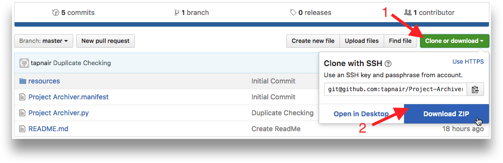
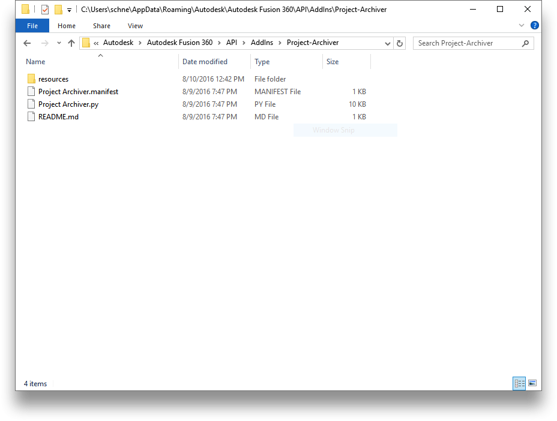
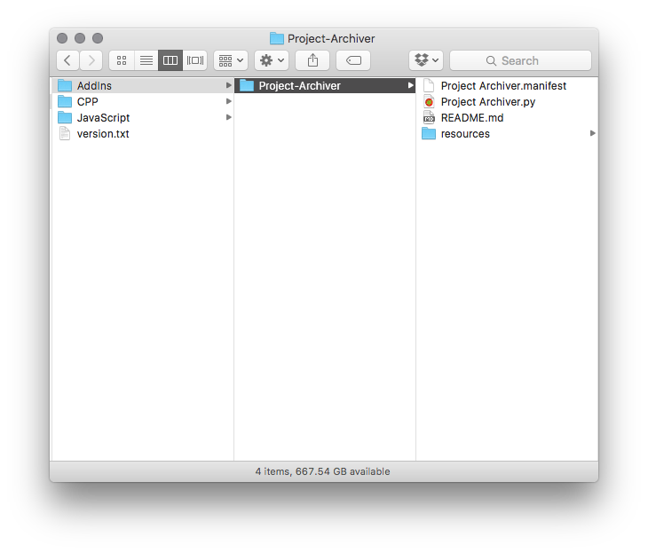
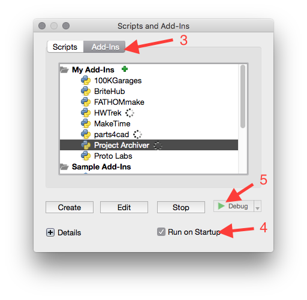
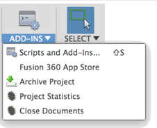
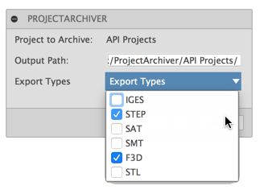
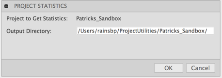

# GeoSIG Fusion 360 Project tools
Tools to GeoSIG products as Fusion 360 Projects
The tools have to filter the documents in the project to apply only on parts, assembly or product and process accordingly.

PCB:
0024_V0.2 Part24 PCB1 internal             -> 0024_V0.2 Part24 PCB1 internal.STEP (archive)
0024_V0.2 Part24 PCB1 internal Drawing     -> GS_07358-0024_V0.2 Part24 PCB1 internal Drawing.pdf (production + archive)
                                           -> GS_07358-0024_V0.2 Part24 PCB1 internal Drawing.dwg (archive)
0024_V0.2 Part24 PCB1 internal CAM         -> GS_07358-0024_V0.2 CAM.dxf (production)

MECH:
0002_V0.2 Part02 Disk base2
0002_V0.2 Part02 Disk base2 Drawing

ASSY:
0506_V0.2 Assy06 Base2 +magnet
0506_V0.2 Assy06 Base2 +magnet Drawing
1000_V0.2 Prod00 Hor cell assembled
1000_V0.2 Prod00 Hor cell assembled Drawing
1001_V0.2 Prod01 Ver cell assembled
1001_V0.2 Prod01 Ver cell assembled Drawing

3D file format:
- STEP most common format defined in  ISO 10303-21, it can handle nicely assemblies (any 3D CAD can import it).
- F3D  native fusion 360 file format for object, only Fusion 360 can read it but it will be a full restore.
CAM file:
- DXF usually easy for CAM file to import in machine or given to supplier, also Eagle can import it
- STL best for CAM in 3D printers
- GCODE toolpath best for CNC but need correct setup of tools. So the machine and tool must be known at creation time. 
  This is more a production format than a design or interchange format.
Drawings:
- DWG for archiving drawing with a reliable but paintfull way to edit them in the long term.
- PDF (2D only) for production and archiving.

#1 Close All documents - Close all open documents within current project.

#2 Update drawing title box - 

#3 New Minor Version - 
Check that version is same for all! else warn and abort.
Create new folder with past revision.
Copy all root object to new folder.
Archive all 3D object as STEP andOM and drawings as DWG+pdf.
Change object to new minor version (name and attributes)

#4 New Major Version - 
Check that version is same for all! else warn and abort.
Create new folder with past revision.
Copy all root object to new folder.
Archive all 3D object as STEP andOM and drawings as DWG+pdf.
Change object to new major version (name and attributes)

#5 Update all assemblies and drawings - 
Check for out of date sub components in assembly or base object in drawings.

#6 Generate all PDF of project - 
Generate the PDF of all drawings.
To go in local folder /PDF of project.

#7 Generate all DXF from any CAM sketch -
Generate the DXF CAM file of any 3D object that has a sketch named CAM.
To go in local folder /CAM of project.

#8 Archive - Allows for the export of all designs as STEP, f3d or other neutral formats.
<FUTURE> Drawings to be saved as DWG.
This is saved in a directory by default like "C:\Users\srudaz\ToolsGeoSIG\<project_name>". 
The target directory is user selectable.

#9 Statistics - Gives releant statistics about all files (3D objects and drawings) and folders in a given project as CSV files.
This is saved in a directory by default like "C:\Users\srudaz\ToolsGeoSIG\<project_name>". 
The target directory is user selectable.

[How to install](#How-to-install)  
[How to use](#How-to-use)

----

### How to install
#### Windows
Download the REPO.  

1. Click Clone or *Download*  
2. Click *Download Zip*  

3. Un-Zip to any convient location.
4. Copy the data to: %AppData%\Autodesk\Autodesk Fusion 360\API\AddIns

5. You should then see:

#### MAC OS
Download the REPO.  

1. Click Clone or **Download**  
2. Click **Download Zip**  

3. Un-Zip to any convient location.
4. Copy the data to: ~/Library/Application Support/Autodesk/Autodesk Fusion 360/API/AddIns

5. You should then see:

### Fusion 360  

1. Launch Fusion 360.
2. On the main toolbar click the **Scripts and Addins** button in the **Addins** Pane

	

3. Select the **Addins tab** and find: ProjectUtilities.  
4. Click **Run at startup**. 
5. Click run.  
 
	

6. Dismiss the Addins dialog.  
7.  On the main toolbar click the **Scripts and Addins** menu and you should see **Archive-Exporter** Pane.

	

----

## How to use

Launch Fusion 360.

In the **Scripts and Addins** dialog box select Add-ins and then "ProjectUtilities"

In the data panel navigate to the project you want to archive.

_The add-in will export all Fusion 360 files in the active project._

The commands will now be in the Add-ins drop down menu:

### Archive
The dialog shows you the **Project to Archive** which is the current active project.

It then allows you to enter a path. Type in a path into the **Output Path** field.
* For OSX this might be: **/Users/*username*/Desktop/Test/**
* For Windows this might be something like **C:\Test**

Finally under **Export Types** select the different files types you want to export.  You can select multiple types.

Click **OK**.

Fusion will open and export each 3D design. Depending on the size of design and bandwidth this can take some time. Fuison 360 will be busy for the duration of the script running, so it would be advisable to run this on a dedicated machine that you can leav to run for some time. 

### Statistics
Select the Statistics command from the addins drop down.

It then allows you to enter a path. Type in a path into the **Output Path** field.

* For OSX this might be: **/Users/*username*/Desktop/Test/**
* For Windows this might be something like **C:\Test**

The default will be into: HOME/ProjectUtilities/**Project_Name**

_files.csv_ : Contains information about all files in the project

_folders.csv_ : Contains information about all the folders in the project

## License
Samples are licensed under the terms of the [MIT License](http://opensource.org/licenses/MIT). Please see the [LICENSE](LICENSE) file for full details.

## Inspired from 

Written by [Patrick Rainsberry](https://twitter.com/prrainsberry)   (Autodesk Fusion 360 Business Development)

See more useful [Fusion 360 Utilities](https://tapnair.github.io/index.html)

